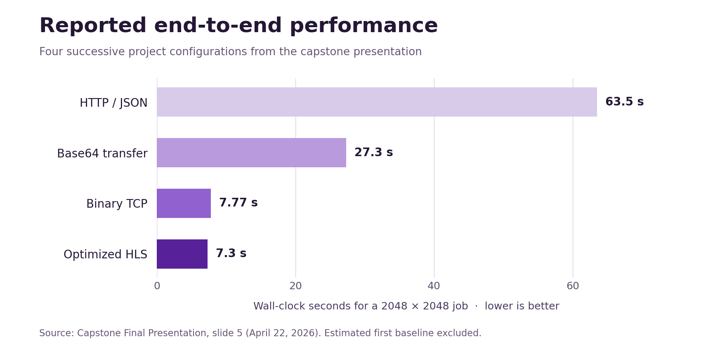

# Massive Matrix Multiplication

CSE 4602 Capstone Design Project  
Team: Amani, Mack, Minh, Chuhan  
Target board: PYNQ-Z2 / Xilinx Zynq-7020

## Project Overview

This repository contains a full-stack FPGA-accelerated matrix multiplication system. The system multiplies matrices by splitting them into tiles, sending each tile to a PYNQ-Z2 FPGA accelerator, and accumulating the tile results on the host/backend side.

The final software stack is organized as a three-tier system:

1. **Frontend**: React + TypeScript web interface for generating/uploading matrices, selecting tile size, starting jobs, viewing progress, and checking timing results.
2. **Backend**: FastAPI service that stores matrices, pads/slices them into tiles, dispatches tile work to the board, collects timing data, and verifies results against NumPy.
3. **PYNQ board server**: Python TCP server running on the PYNQ-Z2. It loads the FPGA bitstream, receives binary tile requests, calls the hardware accelerator, and returns the result tile.


## Performance



The chart reproduces the reported results from our capstone final presentation (April 22, 2026, slide 5). It compares successive project configurations; the slide's estimated first baseline is omitted. These are presentation results, not a CPU comparison or a guaranteed runtime for the default `board/` bitstream. The repository contains separate bitstream and handoff pairs in `board/` and `hls/`.

## Repository Structure

```text
.
├── assets/    # Performance chart from the final presentation
├── backend/   # FastAPI API, tile orchestration, and tests
├── board/     # PYNQ-Z2 server, accelerator driver, and FPGA files
├── frontend/  # React and TypeScript interface
├── hls/       # Hardware source and packaged IP
└── README.md
```

## System Requirements

### Host computer

- Python 3.10 or newer recommended
- Node.js and npm
- Network access to the PYNQ board
- Git

### PYNQ board

- PYNQ-Z2 board connected to the same network as the host computer
- PYNQ image with Python and the `pynq` package installed
- The bitstream and hardware handoff file copied to the same folder as the board server

## Hardware Files

The board server in `board/` expects these files:

```text
board/design_1_wrapper.bit
board/design_1_wrapper.hwh
```

Keep the `.bit` and `.hwh` files in the same directory. PYNQ uses the `.hwh` file as the hardware metadata for the overlay, so the handoff file should stay with the matching bitstream.

## Quick Start

The system must be started in this order:

1. Start the PYNQ board server.
2. Start the FastAPI backend on the host computer.
3. Start the React frontend on the host computer.
4. Open the web interface and run a matrix multiplication job.

## 1. PYNQ Board Setup

Copy the board folder to the PYNQ board. One common method is `scp`:

```bash
scp -r board xilinx@<PYNQ_IP_ADDRESS>:/home/xilinx/capstone-board
```

Then SSH into the board:

```bash
ssh xilinx@<PYNQ_IP_ADDRESS>
cd /home/xilinx/capstone-board
```

Install the board-side Python dependencies if needed:

```bash
pip3 install -r requirements.txt
```

Start the board server:

```bash
python3 app.py --bitstream design_1_wrapper.bit --port 5000
```

Expected behavior:

- The server loads the FPGA overlay.
- The server prints that the accelerator is ready.
- The server listens on `0.0.0.0:5000` for TCP requests from the backend.

If using Jupyter on the PYNQ board instead of SSH, upload the contents of `board/` into one folder, then run the same command from a terminal or notebook cell in that folder.

## 2. Backend Setup

From the repository root on the host computer:

```bash
python -m venv .venv
source .venv/bin/activate      # macOS/Linux
# .venv\Scripts\activate       # Windows PowerShell
pip install -r backend/requirements.txt
```

Set the PYNQ board IP address. Replace the example IP with your board's actual IP address:

```bash
export CAPSTONE_FPGA_HOST=<PYNQ_IP_ADDRESS>
export CAPSTONE_FPGA_PORT=5000
```

On Windows PowerShell:

```powershell
$env:CAPSTONE_FPGA_HOST="<PYNQ_IP_ADDRESS>"
$env:CAPSTONE_FPGA_PORT="5000"
```

Start the backend:

```bash
python -m uvicorn backend.main:app --host 0.0.0.0 --port 8000 --reload
```

Check that the backend is running:

```text
http://localhost:8000/api/health
```

Expected response:

```json
{"status": "ok"}
```

## 3. Frontend Setup

Open a new terminal on the host computer:

```bash
cd frontend
npm install
npm run dev
```

The frontend usually runs at:

```text
http://localhost:5173
```

If the backend is not running on `localhost:8000`, create a `.env` file in `frontend/`:

```bash
VITE_API_BASE_URL=http://<BACKEND_HOST>:8000/api
```

Then restart the frontend:

```bash
npm run dev
```

## 4. Running a Matrix Multiplication Job

In the web interface:

1. For **Matrix A**, choose either:
   - **Generate**: enter rows, columns, and an optional seed, or
   - **Upload CSV**: upload a CSV file containing numeric matrix values.
2. For **Matrix B**, do the same.
3. Make sure the number of columns in Matrix A equals the number of rows in Matrix B.
4. Select a tile size.
5. Start the multiplication job.
6. Watch the progress grid and progress bar.
7. When the job finishes, use verification to compare the FPGA result against the NumPy reference result.

### Matrix Generation

The frontend supports random matrix generation. You enter:

- number of rows
- number of columns
- optional seed

Using a seed makes the random matrix reproducible across runs.

### CSV Upload

CSV upload is supported through the backend endpoint `/api/matrix/upload`. The upload limit is 100 MB. The CSV should contain only numeric values with comma-separated columns.

Example 3 x 3 CSV:

```csv
1,2,3
4,5,6
7,8,9
```

## Tile Size Options

The frontend/backend support these tile sizes:

```text
128 x 128
256 x 256
512 x 512
1024 x 1024
2048 x 2048
```

The tile size controls how the backend slices the input matrices before sending work to the PYNQ board.

General guidance:

- `128` is safest for small tests and debugging.
- `256` is a good default for basic demos.
- `512` and `1024` reduce the number of board round trips and are better for larger benchmarks.
- `2048` is the largest supported option in the UI/backend, but it is more memory-heavy and should be used carefully.

Internally, the board accelerator has these hardware constraints:

- output rows must be divisible by 16
- output columns must be divisible by 16
- inner dimension must be divisible by 128
- maximum tile dimension on the board driver is 2048

The backend pads matrices to the selected tile size before dispatching tiles, so users do not normally need to manually pad input matrices.

## API Summary

The backend runs under `/api`.

| Endpoint | Method | Purpose |
|---|---:|---|
| `/api/health` | GET | Check that the backend is running |
| `/api/matrix/generate` | POST | Generate a random matrix and store it in backend memory |
| `/api/matrix/upload` | POST | Upload a CSV matrix |
| `/api/matrix/{matrix_id}/info` | GET | Get matrix dimensions |
| `/api/multiply` | POST | Start a matrix multiplication job |
| `/api/jobs/{job_id}/progress` | GET | Server-sent events stream for job progress |
| `/api/jobs/{job_id}/timings` | GET | Get timing breakdown after completion |
| `/api/jobs/{job_id}/verify` | POST | Compare FPGA result against NumPy |
| `/api/jobs/{job_id}` | DELETE | Cancel a job |

Example request to generate a matrix:

```bash
curl -X POST http://localhost:8000/api/matrix/generate \
  -H "Content-Type: application/json" \
  -d '{"rows":512,"cols":512,"seed":1}'
```

Example request to start multiplication:

```bash
curl -X POST http://localhost:8000/api/multiply \
  -H "Content-Type: application/json" \
  -d '{"matrix_a_id":"<A_ID>","matrix_b_id":"<B_ID>","tile_size":256}'
```

## Binary Board Protocol

The backend opens persistent TCP connections to the board and sends each tile as binary data instead of nested JSON lists.

Request format:

```text
request_id: 16 bytes
M:          uint32
K:          uint32
N:          uint32
frac_bits:  uint16
flags:      uint16
A data:     int16 raw bytes
B data:     int16 raw bytes
```

Success response format:

```text
request_id: 16 bytes
status:     uint8
M:          uint32
N:          uint32
compute_us: uint32
deser_us:   uint32
ser_us:     uint32
C data:     float32 raw bytes
```

The binary protocol is implemented in:

```text
backend/services/protocol.py
backend/services/dispatcher.py
board/app.py
```

## Timing and Benchmarking

The system tracks timing across these phases:

- client serialization
- network round trip
- client deserialization
- board deserialization
- board computation
- board serialization
- backend accumulation

After a job finishes, timing data is available through:

```text
GET /api/jobs/{job_id}/timings
```

The frontend also includes a benchmark page and timing panel for visualizing performance.

## Testing

Run backend tests from the repository root:

```bash
source .venv/bin/activate
pytest backend/tests
```

The tests cover backend logic such as slicing, accumulation, and orchestration behavior. Hardware-in-the-loop testing requires the PYNQ board server to be running with the matching bitstream loaded.

## Common Issues

### Backend cannot connect to board

Check that:

- the PYNQ board server is running
- the board IP address is correct
- `CAPSTONE_FPGA_HOST` is set correctly
- the host computer and board are on the same network
- port `5000` is not blocked

### Overlay does not load

Check that:

- the `.bit` and `.hwh` files are in the same folder as `app.py`
- the `.hwh` file matches the bitstream
- the bitstream filename passed to `--bitstream` is correct

### Matrix dimensions fail

Check that:

- Matrix A columns equal Matrix B rows
- the selected tile size is one of `128, 256, 512, 1024, 2048`
- the job is not too large for the available host or board memory

### Results look clipped or inaccurate

The board uses 16-bit fixed-point inputs. The backend sends a `frac_bits` value to control scaling. The default backend setting is:

```text
CAPSTONE_FRAC_BITS=9
```

Using fewer fractional bits increases numeric range but reduces precision. Using more fractional bits improves precision but can clip larger values.

## Notes for Final Demo

A reliable demo flow is:

1. Start the board server and confirm the overlay loads.
2. Start the backend and confirm `/api/health` returns `ok`.
3. Start the frontend.
4. Generate two small matrices first, such as `256 x 256` and `256 x 256` with tile size `128` or `256`.
5. Run the job and verify the result.
6. Move to a larger case, such as `512 x 512` or `1024 x 1024`, if the small demo succeeds.
7. Show the timing panel or benchmark page to explain where runtime is spent.

## Main Technologies

- PYNQ-Z2 / Zynq-7020
- Vitis HLS / Vivado
- Python
- FastAPI
- React
- TypeScript
- NumPy
- TCP sockets
- Fixed-point matrix arithmetic
